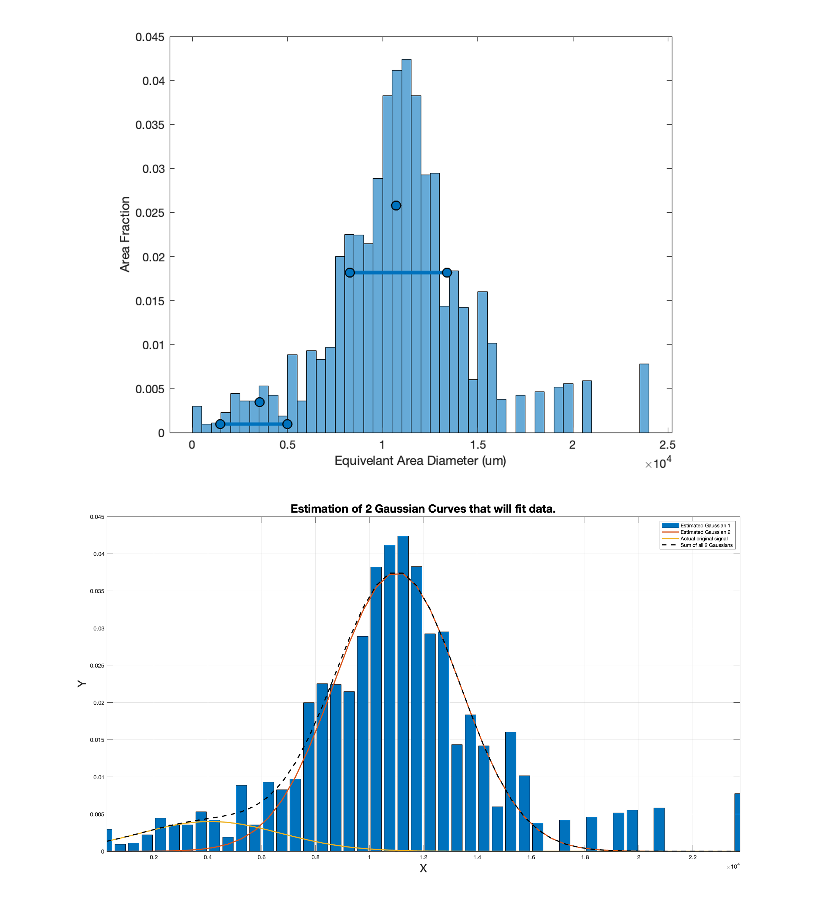

# Co-Ni-MIPAR-Image-Segmentation
 Recipies and Matlab code for segmenting SEM micrographs for secondary and tertiary gamma prime in Superalloys

Two methods of Image Segmentation presented: 
 1. Interactive Matlab environment for simple Image segmentation based on a threshold grey intensity value and fitting multiple gaussians to output data. The main script for this is m_sizedist
 2. Using commercial software MIPAR with a custom recipe (RR-CoNi-Try2.rcp advised) and associated MATLAB script for proscessing .csv exported data - m_plot_MIPAR_output

Also contained in the file are useful functions for dealing with image segmentation:
 * Extract scale data and units from SEM tiff images automatically - f_getSEMScaleData
 * Interactivley fit an arbitary number of gaussians to histogram data - f_FitmultGauss

For method 1:
 * Choose the tiff file of your image using the UI selection
 * Select the appropriate threshold value for your image by moving the slider
 * Wait for the image to be segmented - holes are automatically filled
 * Histogram of area fraction is plotted
 * On this Histogram, you will be prompted to give estimates of the mean and standard deviation for the multi-modal gaussian fit. You can give these by interactivley first drawing a point on the mean estimate and a line representing the std estimate as shown below:

 
